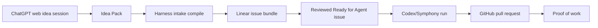

# Codex Agent Harness Template

[](https://github.com/jasonalbers/codex-agent-harness-template/actions/workflows/validate.yml)

A GitHub template for turning ChatGPT-refined product ideas into reviewed
Linear work that Codex can pick up, implement, verify, and turn into pull
requests.

The harness lives in `.agent-harness/`, so product code can stay at the repo
root without colliding with agent workflow internals.

## Who This Is For

Use this template if you want:

- ChatGPT web to refine raw ideas into durable Idea Packs.
- Linear to hold reviewed, scoped implementation work.
- Codex/Symphony to pick up only approved issues.
- GitHub to store branches, pull requests, and proof of work.
- A reusable agent operating model that can be copied into new projects.

This is not a product framework. It is the workflow layer around a product repo.

## Quick Start

Click **Use this template** on GitHub, or open the
[template generator](https://github.com/jasonalbers/codex-agent-harness-template/generate).

In the new repository, install and validate the harness:

```bash
npm --prefix .agent-harness ci
npm --prefix .agent-harness run build
node .agent-harness/dist/cli.js validate repo
```

Create local config when you are ready to connect real services:

```bash
cp .agent-harness/.env.example .agent-harness/.env
cp .agent-harness/config/projects.example.json .agent-harness/config/projects.json
```

Do not commit `.agent-harness/.env` or private project config.

## Starting From ChatGPT Web

Open ChatGPT web, attach the GitHub connector, select this repository, and paste:

```text
Use this repo. Read AGENTS.md and start.
```

ChatGPT web will route through `AGENTS.md`, read the ChatGPT role file, and
start the idea-intake workflow instead of jumping into implementation.

## How Work Moves



ChatGPT web is the product studio. The TypeScript CLI is the compiler and
control surface. Linear is the work queue. Codex executes scoped work after the
issue is clear.

## What This Gives You

- A universal `AGENTS.md` role router for ChatGPT web, Codex, and future tools.
- Role-specific behavior in `.agent-harness/roles/`.
- Idea Pack validation, compilation, and Linear promotion.
- Linear issue ordering for agent pickup.
- Symphony-style Codex execution policy.
- GitHub PR and proof-of-work conventions.
- Template sync for safely pulling future harness updates into derived repos.
- Validation, safety, and public-template hygiene checks.

## Repository Layout

Root files are intentionally minimal:

```text
README.md
AGENTS.md
.gitignore
.github/
.agent-harness/
```

The harness owns:

```text
.agent-harness/
  WORKFLOW.md
  ARCHITECTURE.md
  package.json
  src/cli.ts
  config/
  docs/
  intake/
  roles/
```

## First Run

Install and build the CLI:

```bash
npm --prefix .agent-harness ci
npm --prefix .agent-harness run build
```

Validate the template:

```bash
node .agent-harness/dist/cli.js validate env --dry-run
node .agent-harness/dist/cli.js validate repo
node .agent-harness/dist/cli.js project summary
```

Create local config only when you are ready:

```bash
cp .agent-harness/.env.example .agent-harness/.env
cp .agent-harness/config/projects.example.json .agent-harness/config/projects.json
```

Do not commit `.agent-harness/.env` or private project config.

## ChatGPT Web To Linear

Use ChatGPT web with the GitHub connector as the idea studio. Start from
`AGENTS.md`, complete the role handshake, and follow
`.agent-harness/roles/chatgpt-web.md`.

At the end of the session, ChatGPT should output one `IDEA_PACK_VERSION: 1`
markdown artifact.

Save it to:

```text
.agent-harness/intake/inbox/<idea-id>.md
```

Then run:

```bash
node .agent-harness/dist/cli.js intake validate .agent-harness/intake/inbox/<idea-id>.md
node .agent-harness/dist/cli.js intake compile .agent-harness/intake/inbox/<idea-id>.md
node .agent-harness/dist/cli.js intake promote .agent-harness/intake/compiled/<idea-id> --dry-run
```

When Linear credentials are configured and the dry run looks right:

```bash
AGENT_DRY_RUN=false node .agent-harness/dist/cli.js intake promote .agent-harness/intake/compiled/<idea-id>
```

The intake pipeline preserves:

- High-level idea.
- Decision trail.
- Deferred ideas.
- Rejected ideas.
- Open questions.
- Epics.
- Small Linear-ready issues.

## Pull Template Updates Into A Derived Repo

Repos created from this template can pull future harness updates with:

```bash
node .agent-harness/dist/cli.js template status
node .agent-harness/dist/cli.js template sync --dry-run
node .agent-harness/dist/cli.js template sync --apply
```

The sync command applies only template-owned files and protects product-specific work.

## Project Setup

Add a target project:

```bash
node .agent-harness/dist/cli.js project bootstrap \
  --name example-app \
  --repo example-org/example-app \
  --linear-slug example-app-abc123 \
  --dry-run
```

Write the config after review:

```bash
node .agent-harness/dist/cli.js project bootstrap \
  --name example-app \
  --repo example-org/example-app \
  --linear-slug example-app-abc123
```

Summarize readiness:

```bash
node .agent-harness/dist/cli.js project summary
```

## Linear Commands

Preview issue creation:

```bash
node .agent-harness/dist/cli.js linear create .agent-harness/docs/templates/issue-plan.template.md --dry-run
```

Sync Linear summary:

```bash
node .agent-harness/dist/cli.js linear sync --dry-run
```

## Agent Work

Preview an agent run:

```bash
node .agent-harness/dist/cli.js agent start --project example-app --dry-run
```

The dry run checks the publish path before claiming Linear work, including local
`gh auth status`, a disposable workspace clone, branch creation, writable `.git`
metadata, and `git push --dry-run`.

Start live work only after Linear issues are reviewed and credentials are
configured:

```bash
AGENT_DRY_RUN=false node .agent-harness/dist/cli.js agent start --project example-app
```

## CLI Reference

```bash
node .agent-harness/dist/cli.js help
node .agent-harness/dist/cli.js validate env --dry-run
node .agent-harness/dist/cli.js validate repo
node .agent-harness/dist/cli.js project bootstrap --name example-app --repo example-org/example-app --linear-slug example-app-abc123 --dry-run
node .agent-harness/dist/cli.js project summary
node .agent-harness/dist/cli.js intake new --idea-id example-idea --name "Example Idea"
node .agent-harness/dist/cli.js intake validate .agent-harness/intake/inbox/example-idea.md
node .agent-harness/dist/cli.js intake compile .agent-harness/intake/inbox/example-idea.md
node .agent-harness/dist/cli.js intake promote .agent-harness/intake/compiled/example-idea --dry-run
node .agent-harness/dist/cli.js linear create .agent-harness/docs/templates/issue-plan.template.md --dry-run
node .agent-harness/dist/cli.js linear sync --dry-run
node .agent-harness/dist/cli.js symphony bootstrap
node .agent-harness/dist/cli.js symphony preflight
```

## Public Template Checklist

Before publishing:

```bash
npm --prefix .agent-harness ci
npm --prefix .agent-harness run build
node .agent-harness/dist/cli.js validate repo
git status --short
```

Also confirm:

- No personal names, private repos, local paths, secrets, logs, or generated
  workspaces are committed.
- `.agent-harness/.env` and `.agent-harness/config/projects.json` remain private.
- The GitHub repository description is clear.
- Useful GitHub topics are set:
  - `codex`
  - `agents`
  - `ai-agents`
  - `agent-harness`
  - `agentic-workflow`
  - `automation`
  - `linear`
  - `symphony`
  - `template`
  - `harness-engineering`
  - `agent-orchestration`
  - `developer-tools`

## Why The Harness Lives In `.agent-harness`

This is a template for future projects. The future project should own the root
product files. The harness should stay portable, hidden, and easy to replace or
upgrade.

That means:

- Product code belongs outside `.agent-harness/`.
- Harness docs, config, templates, intake files, and runtime state belong inside
  `.agent-harness/`.
- Root `AGENTS.md` tells agents where the harness lives.
- Root `README.md` explains the template and can be replaced by product-specific
  documentation after adoption if desired.
